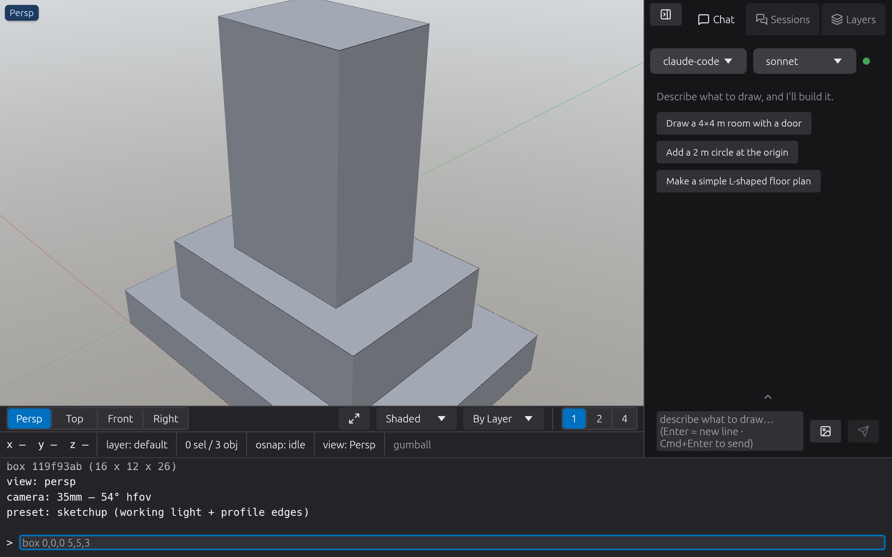
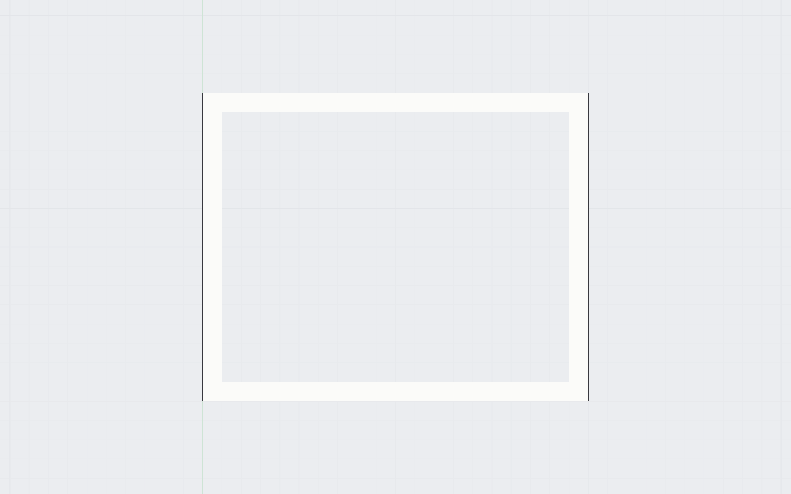
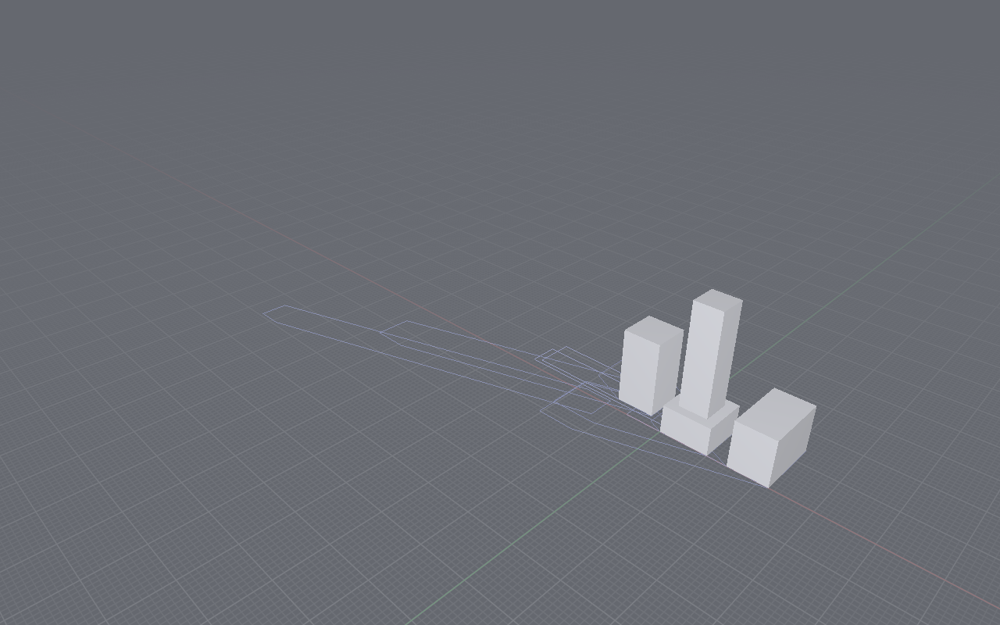
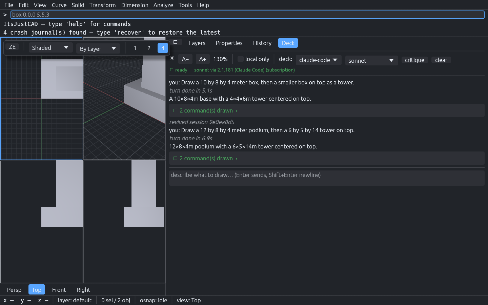

<p align="center">
  <picture>
    <source media="(prefers-color-scheme: dark)" srcset="assets/logo/logo-transparent.png">
    <source media="(prefers-color-scheme: light)" srcset="assets/logo/logo-appstore.png">
    
  </picture>
</p>

# ItsJustCAD

*It's just CAD.*

**A complete architect's CAD in a single ~10 MB binary — with an LLM drafting
partner built into the app.**

FOSS, AGPL-3.0-or-later. Pure Rust (egui + wgpu + glam). Linux / macOS / Windows.

Model buildings, cut plans and sections, lay out dimensioned sheets, print
vector PDFs, exchange DXF/IFC/glTF with every major CAD — and talk to an LLM
that draws with the exact same commands you type.


---

## Download

**[⬇ Download the latest release](https://github.com/htarrido-picart/itsjustcad/releases/latest)** — one file, no installer, nothing else to set up.

| Your OS | Download | First launch |
|---|---|---|
| **macOS** (Apple Silicon) | [⬇ `ItsJustCAD.app`](https://github.com/htarrido-picart/itsjustcad/releases/latest/download/itsjustcad-macos-aarch64-app.tar.gz) | Unpack, then right‑click the app → **Open** (once) |
| **Windows** (x86‑64) | [⬇ `itsjustcad.exe`](https://github.com/htarrido-picart/itsjustcad/releases/latest/download/itsjustcad-windows-x86_64.zip) | Unzip → double‑click → **More info → Run anyway** (once) |
| **Linux** (x86‑64) | [⬇ `itsjustcad`](https://github.com/htarrido-picart/itsjustcad/releases/latest/download/itsjustcad-linux-x86_64.tar.gz) | `tar xzf`, `chmod +x itsjustcad`, then run |

Each link always resolves to the **newest release** — no need to update it per version.

> The app is not code‑signed yet, so your OS shows a one‑time "unidentified
> developer" / "Windows protected your PC" warning on the very first launch.
> Use the step above to open it; after that it just launches. Nothing to
> install, no dependencies — it's a single ~10 MB program.

---

## Why ItsJustCAD

Every CAD tool sits in one corner of the map. **AutoCAD** and **Revit** are
powerful and closed — subscription-only since 2021, expensive, and tethered to
Autodesk's cloud. **Rhino** is cheaper but still closed and paid. **FreeCAD** is
free and open, but perpetually clunky and unfunded. **Shapr3D** is polished but
proprietary. Nobody occupies the obvious lane: **free, open, LLM-native, and
built for architects** — and actually funded well enough to be *good*.

That's ItsJustCAD. It's AGPL-3.0 and will stay that way; a paid mobile edition
pays for the polish, so this isn't another donation-starved side project.

The difference isn't an "AI" button bolted onto a toolbar. **The whole app is
the command language**, and the LLM speaks it natively — it draws with the same
commands you type, teaches you how, and can even *write its own tools* mid-
conversation. Human clicks, typed commands, and the LLM all flow through one
path. There is no second, worse code path for the machine.

And it stays yours: **10 MB, one file, no subscription, no cloud tether.** Your
`.itsjustcad.json` is a readable op-log — the ordered list of commands that
built your model — that you own and can diff forever.

*It's just CAD.*

---

## Build from source

Requires Rust stable (see `rust-toolchain.toml`).

```sh
git clone https://github.com/htarrido-picart/itsjustcad
cd itsjustcad
cargo run --release
```

First run asks two questions — your units (meters / millimeters / feet-inches)
and which CAD you're coming from (**AutoCAD / Rhino / Revit / none**). The UI
adapts: background colors, font sizes, and command aliases match the software
your hands already know. `pl`, `o`, `tr`, `co` all work if you chose AutoCAD.

A 60-second tour — type into the command line (bottom bar):

```
box 0,0,0 10,10,3          # a slab
box 3,3,-1 4,4,5           # a courtyard core
difference last 2 last     # cut the courtyard through the slab
plan 1.5                   # plan cut at 1.5 m → 'sections' layer
display pencil             # hidden-line white-paper view
sheet plan-01 a3           # a paper sheet
sheetview plan-01 top 1:100
print plan-01 plan.pdf     # vector PDF at scale
```

Or tell the deck (right panel): *"make a 10 by 10 slab with a 4 by 4 courtyard
and dimension the south side"* — it emits the same commands, which you can
inspect, undo, and edit.

`help` lists every command in-app; `help difference` explains one;
`itsjustcad --help` prints the same from a terminal. Full generated reference:
[docs/COMMANDS.txt](docs/COMMANDS.txt).

---

## The three ideas

### 1. One command substrate

The human command line, the mouse tools, the gumball, keyboard shortcuts, and
the LLM all emit the same `Command` values through one mutation path. There is
no second code path anywhere — a click-drawn rectangle and an LLM-drawn
rectangle are the same operation.

```
human types "extrude last 3"
      │
LLM emits   {"cmd":"extrude","profile":{"sel":"last","n":1},"height":3.0}
      │
      ▼
   parse → Command::Extrude { … }
      ↓
   apply  (fills id, writes it back)
      ↓
   op-log (the saved file)
```

### 2. The file is the history

A `.itsjustcad.json` file stores no geometry — it stores the ordered list of
commands that built the model. Opening a file replays it. That one decision
buys, for free:

- **Perfect undo/redo** — inverse ops derived per command
- **History editing** — `amend 3 box 0,0,0 8,8,3` rewrites step 3 and
  re-derives everything downstream (parametric-ish editing, no solver)
- **Design options** — `option save scheme-a`, model differently,
  `option save scheme-b`, switch freely; branches live inside the file
- **Crash recovery** — every command is journaled; relaunch, type `recover`
- **Git-friendly files** — diffs read as design changes, not binary noise
- **Fast open** — a checkpoint sidecar skips replay on big files (safe to
  delete, always)

Format documented in [FORMAT.md](FORMAT.md), with a stability promise:
v1 files replay forever.

### 3. Everything is swappable

LLM brains are **cassettes** — Claude (CLI or API), Ollama local models, any
OpenAI-compatible endpoint — one adapter trait, switch in the toolbar, or flip
**local-only** mode so nothing leaves your machine.

And the LLM can *author tools*: ask for a stair generator and it defines a
**plugin** mid-conversation (`plugin define …`); say keep it and it persists to
`~/.config/itsjustcad/plugins/`, appearing in autosuggest, `help`, and the
LLM's own vocabulary from then on. `plugin save <name> <n>` turns your own
last *n* commands into a tool the same way.

---

## Feature tour


*A familiar, Rhino-style interface: menu bar, command line, multi-viewport layout, and a docked panel — it adapts to the CAD you came from.*

### Model
Boxes · extrude · revolve / loft / sweep / **sweep2 (two rails)** /
rail-revolve / variable-radius pipe · booleans (union / difference /
intersect — in-repo BSP CSG) · curves: lines, polylines, arcs, circles,
ellipses, polygons, NURBS, interpolated C2 curves, helix · curve editing:
split / trim / extend / join / fillet / offset / rebuild / draggable control
points · transforms: move / rotate / scale / mirror / copy / linear + polar
arrays · **blocks**: capture any selection as a definition, `insert` instances
anywhere · groups · terrain from survey points (in-repo Delaunay) · LAS point
clouds

### Draw precisely
Object snaps (end / mid / center) · typed coordinates mid-tool (`5.2,3`,
`@2,3` relative, bare distances) · Shift ortho lock · window/crossing
drag-select (Rhino convention) · autosuggest with usage hints as you type ·
gumball on selection

### See
Perspective, true-ortho plan/elevation views · **two-point perspective**
(verticals stay vertical) · lens presets 15–85 mm + phone-camera sims ·
1/2/4 viewport layouts · display modes: shaded / wireframe / x-ray / ghosted /
**pencil** (hidden-line on white paper) · color by layer / object / type /
random · named views · image underlay for tracing scans


*`plan 1.5` + `display pencil`: a hidden-line plan cut — poché walls, an open courtyard, a central core.*

### Analyze
`sun <lat> <lon> <date> <time>` real solar lighting (NOAA SPA, in-repo) ·
`shadowstudy` across a day · `sunhours` heatmap with occlusion ray-casting
(BVH-accelerated) · EPW weather import · measure: distance / area / volume /
bbox · schedules (quantity takeoffs)


*`sun` + `shadowstudy`: real solar position (NOAA SPA) casts shadows across the day.*

### Document
Plan/section cuts — heavy cut lines + light projected edges · elevation views
· linear dimensions (model + paper space) · text · hatches: solid, lines,
crosshatch, brick, concrete, insulation, earth · sheets (A4–A0) with scaled
ortho views, schedule tables, and dimensions · per-layer lineweights · vector
PDF export


*`elevation south`: a clean projected facade — the drafting output, straight from the model.*

### Exchange

| Direction | Formats |
|---|---|
| Import | DXF · OBJ · STL · glTF/GLB · **IFC** · GeoJSON · OSM (Overpass export) · LAS · EPW |
| Export | DXF · OBJ · STL · glTF/GLB · **IFC4** · SVG · CSV · PDF |

IFC is the Revit bridge — both directions, hand-written, zero dependencies.
Native save stays the op-log JSON.

### Automate

```sh
itsjustcad --run script.txt --headless --shot render.png --out model.itsjustcad.json
```

Full headless CLI with exit codes (0 ok / 1 command error / 2 IO) —
scriptable from CI, cron, or another program. `-` reads stdin.

---

## The deck (LLM partner)

The right panel is not a chatbot bolted on — it speaks the command substrate.


*"Draw a podium, then a tower on top" — the deck emits the same commands you'd type, as cards you can inspect, undo, or amend.*

- **Draws** by emitting commands you can inspect (click the command card),
  undo, or amend
- **Teaches**: ask *"how do I make walls from a centerline?"* — it explains
  `offset → extrude → difference` instead of just doing it
- **Sees**: press **critique** — it screenshots your viewport and reviews the
  massing like a design critic
- **Knows your selection**: select something, say "make this taller"
- **Builds tools**: authors persistent plugins on request
- Failed commands feed back automatically for self-correction; conversations
  survive restarts; **local-only** toggle keeps everything on your machine

Configure cassettes in `~/.config/itsjustcad/decks.json`:

```json
{
  "decks": [
    { "name": "claude-code", "kind": "claude_code", "model": "sonnet" },
    { "name": "ollama",  "kind": "openai_compat",
      "base_url": "http://localhost:11434/v1", "model": "qwen3" },
    { "name": "claude",  "kind": "anthropic",
      "base_url": "https://api.anthropic.com",
      "model": "claude-sonnet-4-6", "api_key": "env:ANTHROPIC_API_KEY" }
  ],
  "active": 0
}
```

`api_key` is a literal or `env:VAR`. The model receives the command registry
and a scene digest; it never touches raw geometry.

---

## Keyboard & mouse

| | |
|---|---|
| RMB drag / Shift+RMB / scroll | orbit / pan / zoom |
| `l` `r` `c` `p` | line / rect / circle / polyline tools |
| Delete · Cmd+Z / Cmd+Shift+Z · Cmd+A · Cmd+C/V · Cmd+S | the usual |
| Tab | accept autosuggest |
| Cmd+\ | collapse the deck pane |
| Esc | cancel tool / deselect |
| Drag L→R / R→L | window / crossing select |

---

## Architecture

```
crates/
  kernel-mesh/    f64 face-vertex meshes, primitives, extrusion, BSP CSG,
                  surfacing (revolve/loft/sweep/sweep2), sections, BVH, Delaunay
  kernel-curve/   line/polyline/arc/ellipse/NURBS (own de Boor), tessellation,
                  offset, intersections, fillet
  kernel-brep/    stub — exact BREP planned
  solar/          NOAA SPA solar position, shadow projection, EPW parsing
  doc/            scene state (layers, sheets, blocks, units, sun); knows
                  nothing about how it is mutated
  commands/       THE substrate: Command enum, parser, registry, Session
                  (op-log + inverse-op undo + amend + options + replay),
                  file io, plugins, exporters/importers (dxf/pdf/svg/csv/
                  mesh/ifc/las/geojson/osm)
  deck/           LlmDeck trait, Claude-CLI + OpenAI-compat + Anthropic
                  adapters, streaming ```draft extractor, prompt builder
  render/         wgpu pipelines in egui paint callbacks, display modes,
                  per-viewport cameras, headless renderer
  app/            shell: viewport(s), command line + autosuggest, deck pane,
                  panels, osnap, gumball, keymap, presets, journal
```

## Building & testing

```sh
cargo build --release        # single ~10 MB binary
cargo test --workspace       # 630+ tests
cargo clippy --workspace
scripts/bundle-macos.sh      # unsigned .app bundle

# headless render, no window needed
cargo run -p itsjustcad-render --example headless -- out.png scene.itsjustcad.json

# scripted GUI run: commands + screenshot (used by CI and agents)
ITSJUSTCAD_RUN="rect 0,0,0 6 4;extrude last 3" \
ITSJUSTCAD_SHOT=/tmp/shot.png cargo run -p itsjustcad

# golden-image regression tests
cargo test --workspace -- --ignored golden
```

Minimal dependencies by policy: the CSG engine, DXF/PDF/SVG/glTF/IFC
readers-writers, solar math, Delaunay, and BVH are written in-repo. That
policy — not just Rust — is why the binary is ~10 MB.

## Docs

| File | What |
|---|---|
| [docs/COMMANDS.txt](docs/COMMANDS.txt) | Every command, generated from `--help` |
| [FORMAT.md](FORMAT.md) | The op-log file format + stability promise |
| [CONTRIBUTING.md](CONTRIBUTING.md) | Tests-required, one-substrate rule, minimal deps |
| [docs/ui-legacy-research.md](docs/ui-legacy-research.md) | The AutoCAD/Rhino/Revit conventions the skins implement |

## License

Copyright © 2026 Hector Tarrido-Picart.

**The desktop app is free and open source under AGPL-3.0-or-later** (see
[`LICENSE`](LICENSE) and [`NOTICE`](NOTICE)) — use it, fork it, build on it. The
AGPL's copyleft means any modified or network-served version must also be open.

**Commercial and mobile licensing** (a paid iOS / iPadOS / tablet edition) are
offered separately by the author under proprietary terms — the AGPL covers the
open desktop build only. Contributions are welcome under a CLA (see
[`CONTRIBUTING.md`](CONTRIBUTING.md)).

The file format and command language are documented and stable — build on them.
