<p align="center">
  <picture>
    <source media="(prefers-color-scheme: dark)" srcset="assets/logo/logo-squircle-dark.png">
    <source media="(prefers-color-scheme: light)" srcset="assets/logo/logo-squircle.png">
    
  </picture>
</p>

# ItsJustCAD

*It's just CAD.*

**A complete architect's CAD in a single ~10 MB binary — with an LLM drafting
partner built into the app.**

FOSS, AGPL-3.0-or-later. Pure Rust (egui + wgpu + glam). Linux / macOS / Windows.

Model buildings, cut plans and sections, lay out dimensioned sheets, print
vector PDFs, exchange DXF/IFC/glTF with every major CAD — and talk to an LLM
that draws with the exact same commands you type.


---

## What's new in v0.5.0

- **Accurate ray tracer** — a built-in Rust path tracer renders the *actual*
  model: real PBR materials, sun shadows, and global illumination, no external
  renderer. **Render ▸ Raytrace…** opens a progressive live-preview window
  (samples / bounces / resolution / sun / sky, Stop, Save PNG); `raytrace
  [out.png] [samples] [size]` runs headless. It complements the AI diffusion
  render (which *reimagines* the view).
- **Live parametric structures** — geodesic / hypar / funicular / gaussvault /
  gridshell / tensegrity / cablenet / space-frame stay editable after creation.
  A new **Parameters** tab shows each as a card with a schema-driven editor
  (sliders / numeric / dropdown / toggle) that re-derives the geometry live;
  `paramset` edits from the command line, `freeze` / `bake` flattens to a static
  mesh.
- **Local, offline AI render** — the **Render Setup** panel downloads a local
  Stable Diffusion model and detects the user-installed `sd`
  (stable-diffusion.cpp) binary, so `render <prompt>` can run entirely on your
  machine (needs the `sd` binary + a model download — not one-click yet).
- **Object snap** — endpoint / midpoint / center / intersection / perpendicular /
  tangent / quadrant / nearest / node / vertex, with a clickable status-bar
  osnap chip, a **View ▸ Object Snap…** panel, and an `osnap` verb.
- **Associative dimensions** — `dim @wall.start @wall.end` binds a dimension to
  geometry; move the object and the dimension follows.
- **All Romance languages** — the UI now ships in English, Spanish, Portuguese,
  French, Italian, Romanian, Catalan, and Galician (seed translations — native
  review welcome), and the deck replies in the chosen language.
- **In-app update check** — **Help ▸ Check for Updates…** compares against the
  latest GitHub release.
- **UI** — Blocks tab (double-click a block to reveal it, search + library "+"),
  a Plugins popup and a root-level Plugins menu, a Sheets tab (per-sheet list +
  preview), reliable Quit / Close menu items, and a **⌘G** gumball toggle.
- **~40 CAD-parity verbs** — a broad batch of AutoCAD/Rhino/DraftSight-style
  drafting, selection, annotation, block/xref, sheet-set and interop commands.
  See **[CAD-parity commands](#cad-parity-commands)** for the full grouped list;
  highlights below.

---

## Download

**[Download the latest release](https://github.com/htarrido-picart/itsjustcad/releases/latest)** — one file, no installer, nothing else to set up.

| Your OS | Download | First launch |
|---|---|---|
| **macOS** (Apple Silicon) | [`ItsJustCAD.app`](https://github.com/htarrido-picart/itsjustcad/releases/latest/download/itsjustcad-macos-aarch64-app.tar.gz) | Unpack, then see **[Opening on macOS](#opening-on-macos-unsigned-app)** (once) |
| **macOS** (Intel) | [`ItsJustCAD.app`](https://github.com/htarrido-picart/itsjustcad/releases/latest/download/itsjustcad-macos-x86_64-app.tar.gz) | Unpack, then see **[Opening on macOS](#opening-on-macos-unsigned-app)** (once) |
| **Windows** (x86‑64) | [`itsjustcad.exe`](https://github.com/htarrido-picart/itsjustcad/releases/latest/download/itsjustcad-windows-x86_64.zip) | Unzip → double‑click → **More info → Run anyway** (once) |
| **Linux** (x86‑64) | [`itsjustcad`](https://github.com/htarrido-picart/itsjustcad/releases/latest/download/itsjustcad-linux-x86_64.tar.gz) | `tar xzf`, `chmod +x itsjustcad`, then run |

Each link always resolves to the **newest release** — no need to update it per version.

### Opening on macOS (unsigned app)

The app isn't code‑signed/notarized yet, so macOS quarantines it on download. On
**macOS 15 (Sequoia)** the first‑launch dialog only offers *Done / Move to Trash*
— the old "right‑click → Open" trick no longer works. Use one of these (once):

**System Settings (no terminal)**
1. Unpack, double‑click **ItsJustCAD** → the "Not Opened" dialog appears → click **Done**.
2. Open  → **System Settings ▸ Privacy & Security**.
3. Scroll down to *"ItsJustCAD was blocked to protect your Mac."* → click **Open Anyway** → authenticate → **Open Anyway** again.

**Terminal (one line, most reliable)**
```sh
xattr -dr com.apple.quarantine /path/to/ItsJustCAD.app   # e.g. ~/Downloads/ItsJustCAD.app
```
Then double‑click. This strips the quarantine flag so Gatekeeper stops blocking it.

After the first successful open it launches normally. (Signing + notarization,
which removes this entirely, is planned.)

### User Beta Review

Testing the beta? Open **[`docs/beta-review.html`](docs/beta-review.html)** in
your browser — a comprehensive, tickable manual-test checklist covering every
v0.5.0 area (modeling, expressive & live-parametric structures, intemfit site
planning, environmental analysis, compliance pre-check, landscape/planting, DWG
import, the LLM deck, language/skins, sheets/PDF, interop, the ray tracer + AI
render, object snap, associative dimensions, the update check, and the UI). Work
through it, tick what passes, jot notes on anything that doesn't, then click
**Export results** to download a JSON of your run and send it back — email
[htarrido@pm.me](mailto:htarrido@pm.me) or open a GitHub issue. Your ticks and
notes are saved in the browser as you go.

> The app is not code‑signed yet, so your OS shows a one‑time warning on first
> launch: macOS — see **[Opening on macOS](#opening-on-macos-unsigned-app)**;
> Windows — **More info → Run anyway**. After that it just launches. Nothing to
> install, no dependencies — it's a single ~10 MB program.

---

## Why ItsJustCAD

Every CAD tool sits in one corner of the map. **AutoCAD** and **Revit** are
powerful and closed — subscription-only since 2021, expensive, and tethered to
Autodesk's cloud. **Rhino** is cheaper but still closed and paid. **FreeCAD** is
free and open, but perpetually clunky and unfunded. **Shapr3D** is polished but
proprietary. Nobody occupies the obvious lane: **free, open, LLM-native, and
built for architects** — and actually funded well enough to be *good*.

That's ItsJustCAD. It's AGPL-3.0 and will stay that way; a paid mobile edition
pays for the polish, so this isn't another donation-starved side project.

The difference isn't an "AI" button bolted onto a toolbar. **The whole app is
the command language**, and the LLM speaks it natively — it draws with the same
commands you type, teaches you how, and can even *write its own tools* mid-
conversation. Human clicks, typed commands, and the LLM all flow through one
path. There is no second, worse code path for the machine.

And it stays yours: **10 MB, one file, no subscription, no cloud tether.** Your
`.itsjustcad.json` is a readable op-log — the ordered list of commands that
built your model — that you own and can diff forever.

*It's just CAD.*

---

## Build from source

Requires Rust stable (see `rust-toolchain.toml`).

```sh
git clone https://github.com/htarrido-picart/itsjustcad
cd itsjustcad
cargo run --release
```

First run asks two questions — your units (meters / millimeters / feet-inches)
and which CAD you're coming from (**AutoCAD / Rhino / Revit / none**). The UI
adapts: background colors, font sizes, and command aliases match the software
your hands already know. `pl`, `o`, `tr`, `co` all work if you chose AutoCAD.

The interface is fully localized — **every Romance language** ships in-app:
English, Spanish (Español), Portuguese (Português), French (Français), Italian
(Italiano), Romanian (Română), Catalan (Català), and Galician (Galego). Switch
anytime with the `language <code>` verb or the language setting; the deck
replies in your chosen language too. Missing keys fall back to English, so
nothing is ever blank. The non-English catalogs are seed translations — native
review is welcome.

A 60-second tour — type into the command line (bottom bar):

```
box 0,0,0 10,10,3          # a slab
box 3,3,-1 4,4,5           # a courtyard core
difference last 2 last     # cut the courtyard through the slab
plan 1.5                   # plan cut at 1.5 m → 'sections' layer
display pencil             # hidden-line white-paper view
sheet plan-01 a3           # a paper sheet
sheetview plan-01 top 1:100
print plan-01 plan.pdf     # vector PDF at scale
```

Or tell the deck (right panel): *"make a 10 by 10 slab with a 4 by 4 courtyard
and dimension the south side"* — it emits the same commands, which you can
inspect, undo, and edit.

`help` lists every command in-app; `help difference` explains one;
`itsjustcad --help` prints the same from a terminal. Full generated reference:
[docs/COMMANDS.txt](docs/COMMANDS.txt).

---

## The three ideas

### 1. One command substrate

The human command line, the mouse tools, the gumball, keyboard shortcuts, and
the LLM all emit the same `Command` values through one mutation path. There is
no second code path anywhere — a click-drawn rectangle and an LLM-drawn
rectangle are the same operation.

```
human types "extrude last 3"
      │
LLM emits   {"cmd":"extrude","profile":{"sel":"last","n":1},"height":3.0}
      │
      ▼
   parse → Command::Extrude { … }
      ↓
   apply  (fills id, writes it back)
      ↓
   op-log (the saved file)
```

### 2. The file is the history

A `.itsjustcad.json` file stores no geometry — it stores the ordered list of
commands that built the model. Opening a file replays it. That one decision
buys, for free:

- **Perfect undo/redo** — inverse ops derived per command
- **History editing** — `amend 3 box 0,0,0 8,8,3` rewrites step 3 and
  re-derives everything downstream (parametric-ish editing, no solver)
- **Design options** — `option save scheme-a`, model differently,
  `option save scheme-b`, switch freely; branches live inside the file
- **Crash recovery** — every command is journaled; relaunch, type `recover`
- **Git-friendly files** — diffs read as design changes, not binary noise
- **Fast open** — a checkpoint sidecar skips replay on big files (safe to
  delete, always)

Format documented in [FORMAT.md](FORMAT.md), with a stability promise:
v1 files replay forever.

### 3. Everything is swappable

LLM brains are **cassettes** — Claude (CLI or API), Ollama local models, any
OpenAI-compatible endpoint — one adapter trait, switch in the toolbar, or flip
**local-only** mode so nothing leaves your machine.

And the LLM can *author tools*: ask for a stair generator and it defines a
**plugin** mid-conversation (`plugin define …`); say keep it and it persists to
`~/.config/itsjustcad/plugins/`, appearing in autosuggest, `help`, and the
LLM's own vocabulary from then on. `plugin save <name> <n>` turns your own
last *n* commands into a tool the same way.

---

## Feature tour


*A familiar, Rhino-style interface: command line, viewport with view/snap chips, and a docked panel (Chat, Sessions, Layers, and contextual Parameters/Sheets/Blocks) — it adapts to the CAD you came from.*

Every showcase image below is rendered by
[`docs/examples/render-examples.sh`](docs/examples/render-examples.sh) from a
tiny, deterministic command script in
[`docs/examples/scenes/`](docs/examples/scenes) through the same headless
`--run … --shot` path used by CI — paste the script into the command line to get
the same model, or re-run the script on any GPU machine to regenerate the images.

### Model
Boxes · extrude · revolve / loft (with guide curves) / **blend** / sweep /
**sweep2 (two rails)** / rail-revolve / variable-radius pipe · booleans
(union / difference / intersect — in-repo BSP CSG) · curves: lines, polylines,
arcs, circles, ellipses, polygons, NURBS, interpolated C2 curves, helix ·
curve editing: split / trim / extend / join / fillet / offset / rebuild /
knot-insert / draggable control points · **2D sketch constraints** (parametric
solver: coincident, parallel, perpendicular, distance, tangent, … with DOF /
conflict diagnostics) · transforms: move / rotate / scale / mirror / copy /
linear + polar arrays · **blocks** incl. **parametric (dynamic) blocks** and an
on-disk block library · groups · terrain from survey points (in-repo Delaunay) ·
LAS / LAZ / E57 point clouds

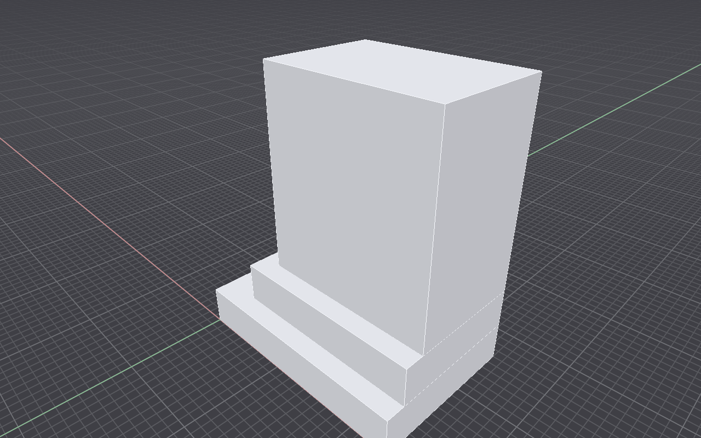
*A few `box` commands: a podium, a stepped base, and a tower — massing in seconds.*

### Form-finding & expressive structures
Dynamic-relaxation form-finding — funicular / catenary arches (Gaudí),
tensegrity, Frei-Otto cable nets and **minimal surfaces** (`minsurf`) — plus
analytic shells: hyperbolic paraboloids, geodesic domes, space frames, Gaussian
catenary vaults (Dieste), and grid shells. These generators stay **live and
parametric** — each appears as a card in the **Parameters** tab with a
schema-driven editor (sliders / numeric / dropdown / toggle) that re-derives the
geometry live; `paramset last frequency=4` does the same from the command line,
and `freeze` / `bake` flattens to a static mesh when you're done. Structural
members (beam / column / slab / wall / grid / story / loads / supports) as
geometry + BIM metadata — recorded for interop, **never analysed here**.

```
geodesic 3 5 dome
hypar 5 5 6
move last 16,0,0
gridshell vault 8 10 3
move last 30,0,0
funicular -4,0,5 4,0,5 24 1 1.4 invert
move last 6,16,0
tensegrity 3 3 6 40
move last 18,16,0
polyline 0,0,0 6,0,2 6,6,0 0,6,2 closed
minsurf last 16
move last 26,14,0
```

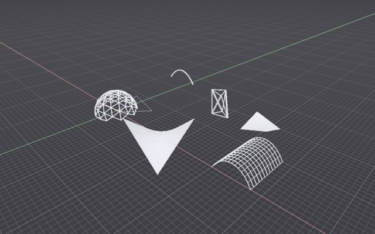

*Six generators in one scene — a geodesic dome, a `hypar` saddle, a `gridshell`
vault, an inverted `funicular` arch, a `tensegrity` mast, and a `minsurf` soap
film across a warped quad. Each stays live in the **Parameters** tab (or via
`paramset`) until you `freeze` it. `funicular`/`tensegrity`/`minsurf` are
strut/line nets, so they read as wireframe rather than solid shells.*

#### Gaussian vaults (Dieste)

The `gaussvault` generator is the app's take on Eladio Dieste's *cerámica
armada* — the undulating, double-curvature thin-brick shell he pioneered. One
verb gives the whole family:

```
gaussvault 12 20 4 undulate
gaussvault 9 20 3.2 straight
move last 20,0,0
funicular -5,0,6 5,0,6 24 1 2.4 invert
move last 36,6,0
```

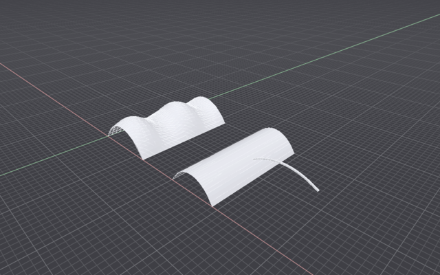

*The hero (left) is `gaussvault … undulate` — the wavy Gaussian shell whose
crest rises and falls along its length, the signature Dieste form that lets a
few centimetres of brick span wide bays. Beside it, `… straight` shows the plain
single-curvature vault, and an inverted `funicular` catenary completes the
form-found masonry family. The vault is a surface mesh, so a `brick` hatch (which
needs a **closed 2-D boundary curve**) can't lie on it — the shell renders on its
own; use `hatch` on a flat section cut if you want the brick coursing drawn.*

### Draw precisely
Full object snap set — endpoint / midpoint / center / intersection /
perpendicular / tangent / quadrant / nearest / node / vertex — with a clickable
status-bar osnap chip, a **View ▸ Object Snap…** panel, and per-snap toggles
(`osnap end on`) · typed coordinates mid-tool (`5.2,3`, `@2,3` relative, bare
distances) · Shift ortho lock · window/crossing drag-select (Rhino convention) ·
autosuggest with usage hints as you type · gumball on selection (⌘G to toggle) ·
a movable **construction plane** (`cplane` / `ucs`: world / origin+normal /
3-point / save+recall) so typed coordinates land on any drawing plane — logged
geometry always stores world coords, so the CPlane never affects replay

### Edit like a drafter
Precision curve editing — `trim` (against picked cutters), `powertrim` (trim
against *all* curves, pick the segment to drop), `stretch` (move only the
vertices inside a box), `flatten` (project to the XY ground), `tozero` /
`toorigin` (drop the bounding-box min onto the origin), and `align` / `orient`
(match two source points to two targets, optional uniform scale) ·
tangent/perpendicular construction lines (`linetan`, `lineperp`) and TTR circles
(`circletan`, line–line case) · `arraycurve` distributes copies along a path ·
rich selection: `selregion` / `selwindow` / `selcrossing` (rectangle),
`selsimilar` (same layer / color / type / weight), `seldup` (find geometric
duplicates) · an editable **Properties** panel for the current selection

### See
Perspective, true-ortho plan/elevation views · **two-point perspective**
(verticals stay vertical) · 360° panorama + fisheye · lens presets 15–85 mm +
phone-camera sims (iPhone / Pixel / Galaxy) · 1/2/4 viewport layouts · display
modes: shaded / wireframe / x-ray / ghosted / **pencil** (hidden-line on white
paper) · **sketchy NPR edges** + SketchUp look preset · appearance materials
(glass / metal / concrete / wood) · georeferenced OSM / satellite basemap ·
color by layer / object / type / random · named views · image underlay for
tracing scans · **built-in ray tracer** — a Rust path tracer that renders the
real model with PBR materials, sun shadows, and global illumination (**Render ▸
Raytrace…** progressive window + headless `raytrace` verb) · **AI diffusion
render** of the current view — reimagines the view from a prompt (opt-in;
ComfyUI / A1111 / Draw Things / Replicate, or a fully **local, offline** Stable
Diffusion via the Render Setup panel + `sd` binary; ships with no backend
active)

The same model, two ways — a shaded perspective and the hidden-line **pencil**
display mode (append a view/display to any script; these are view state, never
logged):

```
persp
display shaded
```

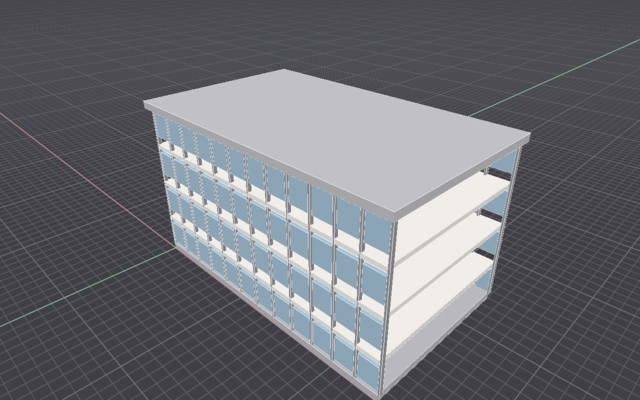 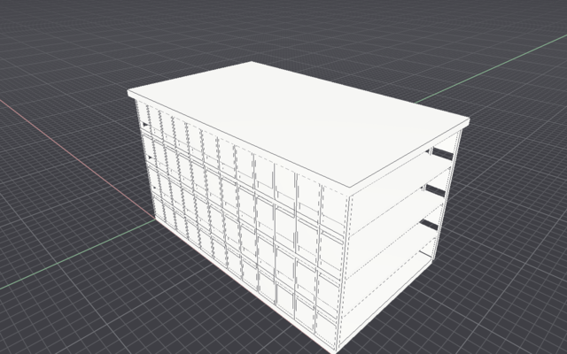

*Left: `display shaded` perspective. Right: `display pencil` — hidden-line linework
on white paper, straight from the model. Other verbs in this family: `camera
2point` (verticals stay vertical), `camera 24` / `camera phone iphone-ultrawide`
(lens presets), `top` / `front` (true-ortho views), and `display wireframe` /
`xray` / `ghosted`.*


*`plan 1.5` + `display pencil`: a hidden-line plan cut — poché walls around an open courtyard.*

### Analyze the environment
`sun <lat> <lon> <date> <time>` real solar lighting (NOAA SPA, in-repo) ·
`shadowstudy` across a day · `sunhours` ground heatmap · `facesunhours` per-face
insolation · `radiation` annual kWh/m²·yr from EPW weather · `sunpath` yearly
dome diagram — all occlusion ray-cast (BVH-accelerated, rayon-parallelised) ·
EPW weather import · measure: distance / area / volume / bbox · schedules
(quantity takeoffs). Every study stores a structured `report` the deck reads to
critique the design in numbers.

```
box 0,0,0 8,8,10
box 14,2,0 6,6,6
box 2,14,0 6,6,7
location 40.71 -74.01 -5
sun 40.71 -74.01 2024-06-21 15:00
sunhours 2024-06-21 1.5
```

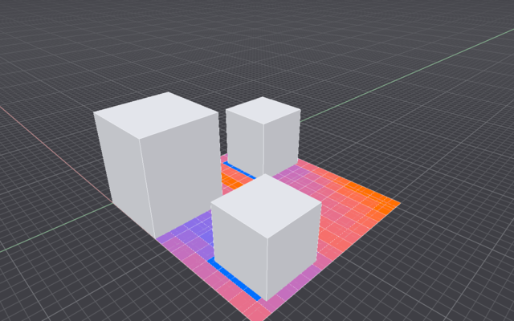

*`sunhours` samples a ground grid and ray-casts toward the sun every 30 min of
the date (occlusion-tested against the massing), colouring an overlay blue (few
hours, in shadow) to red (full sun). `report sunhours` prints the numbers to
design with. Swap in `shadowstudy 2024-06-21 09:00 15:00 120` for time-stamped
cast-shadow polygons instead of the heatmap.*

### Landscape & site
Terrain from survey points or contours · `contours` extraction · grading —
`pad` building pads with side slopes + `cutfill` earthwork volumes · planting
from a **33-species catalog** (temperate ornamentals + Caribbean / Valle del
Cauca / Guayaquil tropical packs): `plant`, `plantrow`, climate-aware advisories,
`miyawaki` native mini-forests, `plantschedule` takeoffs, 2D plan symbols ·
hardscape `sitepath` ribbons draped on terrain · drainage `flowarrows` /
`ponding` (advisory visualisation, not hydrology engineering) · OSM building
context.

```
location 10.5 -66.9 -4
rect 0,0,0 44 28
plantrow roystonea-regia 2,2 42,2 6
plantrow roystonea-regia 2,26 42,26 6
plant mangifera-indica 10,10 12
plant mangifera-indica 22,10 12
plant mangifera-indica 34,10 12
plant mangifera-indica 10,18 12
plant mangifera-indica 22,18 12
plant mangifera-indica 34,18 12
plant delonix-regia 22,14 10
```

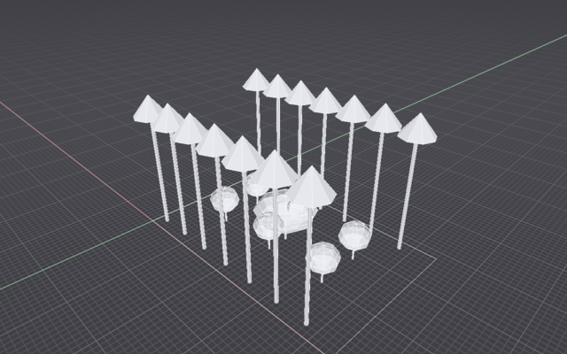

*A tropical courtyard: two rows of royal palms (`plantrow roystonea-regia`)
framing a grid of 12-year-old mango trees with a flamboyán (`delonix-regia`)
specimen at the centre — all from the embedded 33-species catalog, drawn as
canopy meshes that occlude sun like any other geometry. `plantschedule` exports a
takeoff; with a `location` set, off-climate species print an advisory.*

### Plan a site
Parcel-scale site planning: `lotsubdivide` splits a parent lot into buildable
lots · `lotsetbacks` / `lotfrontage` / `lotopenspace` / `lotloading` apply
zoning envelope rules · `lotbuilding` places massing within the envelope ·
`lotgeneratesite` lays out a full site from settings · `lotreport` gives a
structured yield/coverage takeoff the deck can critique. Envelope and zoning
parameters are advisory geometry aids — verify allowable use, density, and
setbacks with the local zoning authority.

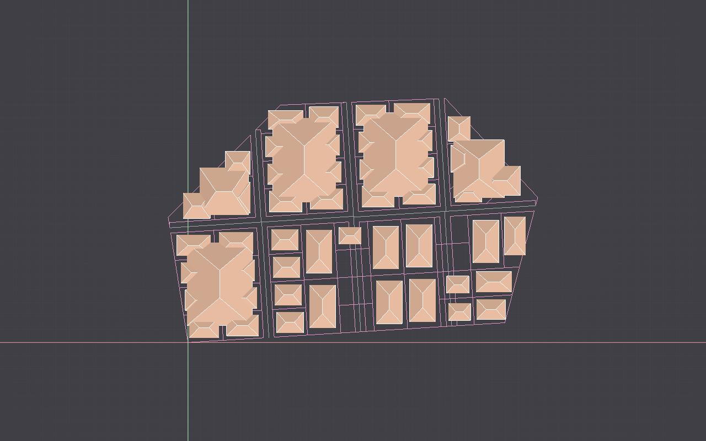
*`lotgeneratesite` → `lotsubdivide` → `lotsetbacks` → `lotbuilding`: a full site from one boundary, plus a `lotreport` yield.*

### Pre-check code compliance (advisory only)
`codecheck <pack>` runs declarative geometric pre-checks — embedded `ibc2021`
(egress: risers, treads, corridor/stair/door widths, headroom, occupant load,
exit count, travel distance) and `ada2010` (ramp slopes + landings, clear
widths, turning space, thresholds, accessible parking) — then `report codecheck`
gives per-rule verdicts with measured-vs-required numbers. **This is an advisory
pre-check, never a code review: it never certifies compliance. Verify with a
licensed professional / AHJ.** Rule packs are LLM-authorable JSON, so editions
swap in without code.

```
box 0,0,0 20,14,0.3
layer walls
box 0,0,0.3 20,0.25,3.2
box 0,13.75,0.3 20,0.25,3.2
box 0,0,0.3 0.25,14,3.2
box 19.75,0,0.3 0.25,14,3.2
layer route
polyline 2,7,0 8,7,1.2
name last ramp
polyline 8,7,0 18,7,0
name last corridor
codecheck demo
report codecheck
```

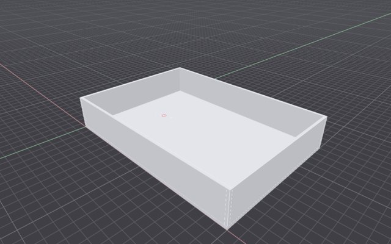

The verdict is textual — `report codecheck` grounds the pass/fail in measured vs
required numbers (the deliberately-steep ramp above trips the 1:12 rule), and
failures also drop coloured markers on the `compliance` layer:

```
codecheck demo: 6 rule(s) — advisory pre-check, not a code review — verify with a licensed professional / AHJ
  ramp-slope    [cf. ADA 405.2]     FAIL — measured 0.200 vs required 0.083 rise/run (1 checked); ramp/path segment steeper than 1:12
  door-width    [cf. ADA 404.2.3]   PASS (0 checked)
  stair-riser   [cf. IBC 1011.5.2]  PASS (0 checked)
  headroom      [cf. IBC 1011.3]    PASS (1 checked)
  corridor-width [cf. ADA 403.5.1]  PASS (1 checked)
  guard-check   [cf. IBC 1015.2]    PASS — measured 0.300 vs required 0.762 m (1 checked)
```


*`sun` + `shadowstudy`: real solar position (NOAA SPA) casts shadows across the day.*

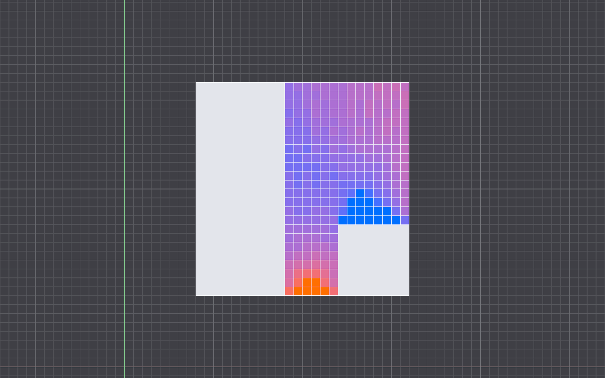
*`sunhours`: an occlusion-accurate heatmap of direct-sun hours; `report sunhours` prints the numbers to design with.*

### Document
Plan/section cuts — heavy cut lines + light projected edges · elevation views
· linear dimensions (model + paper space), incl. **associative dimensions** that
bind to geometry — `dim @wall.start @wall.end` follows the object when it moves
· radial / diameter dimensions (`dimradius`, `dimdiameter`), **angular
dimensions** (`dimangular`), and one-shot `autodim` (batch-dimension a whole
selection) · **field text** (`field`) bound to a live value — area / length /
count / layer / units — that auto-updates after edits · text · hatches: solid,
lines, crosshatch, brick, concrete, insulation, earth, the ANSI31–38 set, and
custom patterns imported from AutoCAD `.pat` files (`hatchpat`; dash cadence is
read faithfully but rendered approximately) · `boundary` traces a closed region
from a seed point, and `curvebool` unions / intersects / differences closed
planar curves into new regions · sheets (A4–A0) with scaled ortho views,
schedule tables, and dimensions · **sheet sets** (`sheetset`: ordered index over
sheets → one multi-page PDF via `publish`) · **plot styles / pen tables**
(`plotstyle`: named layer/color → pen color + weight + screening, applied only
at print) · per-layer lineweights · vector PDF export

#### Dimensioned drawing sheet (paper space)

A real drawing sheet: a 24 × 14 m office floor plan (perimeter walls, a service
core, a demising partition) placed on an **A3 sheet at 1:100**, dimensioned in
**paper space** with `sheetdim`. The dimensions live on the sheet in millimetres
at drawing scale — they are *not* baked into the 3D model — and `print` renders
the sheet to a vector PDF:

```
layer walls
box 0,0,0 24,0.25,3.2
box 0,13.75,0 24,0.25,3.2
box 0,0,0 0.25,14,3.2
box 23.75,0,0 0.25,14,3.2
layer core
box 9,4.5,0 6,0.25,3.2
box 9,9.5,0 6,0.25,3.2
box 9,4.5,0 0.25,5,3.2
box 14.75,4.5,0 0.25,5,3.2
layer partition
box 9,0,0 0.2,4.5,3.2
box 9,9.5,0 0.2,4.5,3.2

sheet A-101 a3
sheetview A-101 top 1:100

# paper-space dims (mm on the sheet): the plan is centred in the viewport,
# so model (mx,my) → paper (mx*10 + 90, my*10 + 84.5) at 1:100.
sheetdim A-101 90,84.5 330,84.5 -14      # overall width  (24 m)
sheetdim A-101 90,84.5 90,224.5 -14      # overall depth  (14 m)
sheetdim A-101 90,224.5 180,224.5 12     # west bay to core (9 m)

sheettext A-101 250,282 A-101  GROUND FLOOR PLAN 5
sheettext A-101 250,276 SCALE 1:100  --  A3 3.5

print A-101 A-101.pdf
```

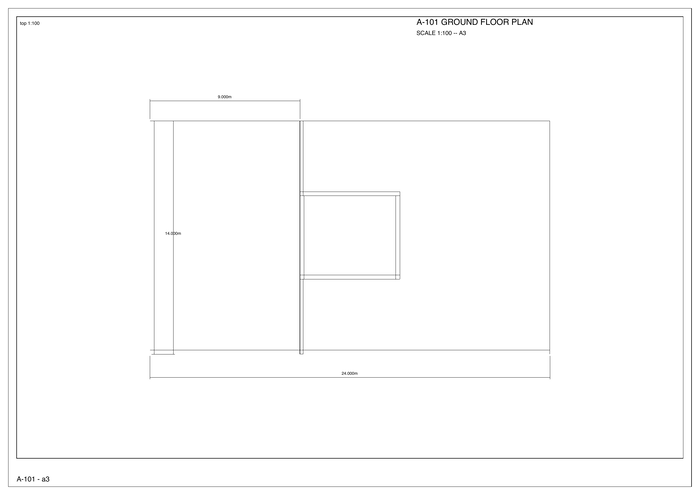

*The dimension lines, witness lines and measurements sit in document/paper space
at 1:100 — `sheetdim` measures on the sheet, so the same plan re-dimensions
correctly at any viewport scale. `print` outputs the drawing as a vector PDF.*

A believable multi-storey building — a plinth, three floor slabs and a roof, a
service core, and a real curtain-wall facade built by `array`-ing mullions and
glazing panels across both long elevations:

```
layer plinth
layercolor plinth 0.45,0.45,0.48
box 0,0,0 24,14,0.6
layer slabs
layercolor slabs 0.82,0.80,0.76
box 0,0,3.2 24,14,0.35
box 0,0,6.6 24,14,0.35
box 0,0,10.0 24,14,0.35
layer roof
layercolor roof 0.5,0.5,0.52
box -0.4,-0.4,13.4 24.8,14.8,0.6
layer core
layercolor core 0.6,0.58,0.55
box 9,5,0.6 6,5,12.8
layer glazing
layercolor glazing 0.35,0.5,0.62
box 0.3,0.02,0.9 1.7,0.25,2.0
array last 12,1,4 2.0,0,3.4
box 0.3,13.73,0.9 1.7,0.25,2.0
array last 12,1,4 2.0,0,3.4
layer mullion
layercolor mullion 0.3,0.3,0.32
box 0,0,0.6 0.16,0.3,12.8
array last 13,1,1 2.0,0,0
box 0,13.7,0.6 0.16,0.3,12.8
array last 13,1,1 2.0,0,0
```


*A 24 × 14 m, four-storey building framed in perspective (`persp`). Each `array`
lays a course of glazing panels or mullions in one command — a 12-bay × 4-storey
curtain wall per face — with the floor slabs, roof, plinth and core on their own
coloured layers. Type `front` to read it as a clean curtain-wall elevation
instead:*

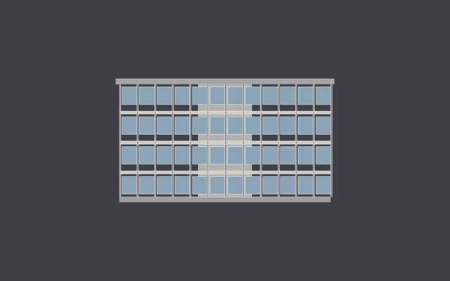

#### Venetian palazzo facade (round-arched bays)

The same `box` + `array` moves that build a curtain wall also assemble a
traditional facade. This is a five-bay, three-storey Venetian palazzo — a plinth
and base course, a ground arcade of tall round arches, two upper floors of
arched windows, and a string-course cornice. Each round arch head is an `arc`
stood upright with `rotate … 90 x` (the app's `arc` is drawn in the XY plane, so
it's rotated into the vertical elevation plane), then `array`-ed across the five
bays; the stone, glazing, opening and trim reads live on their own layers:

```
layer stone
layercolor stone 0.86,0.82,0.74
box 0,0,0 20,1.2,0.6
box -0.4,-0.1,0.6 20.8,1.3,0.25
box 0,0,0.85 20,0.8,10.35
box -0.5,-0.15,11.2 21,1.35,0.9
box -0.6,-0.2,12.1 21.2,1.4,0.35
layer opening
layercolor opening 0.60,0.53,0.42
box 0.9,0,0.85 2.2,0.85,3.0
array last 5,1,1 3.6,0,0
box 1.2,0,4.8 1.6,0.85,2.4
array last 5,1,1 3.6,0,0
box 1.2,0,7.9 1.6,0.85,2.2
array last 5,1,1 3.6,0,0
layer glazing
layercolor glazing 0.28,0.40,0.50
box 1.1,0.3,1.05 1.8,0.15,1.95
array last 5,1,1 3.6,0,0
box 1.35,0.3,5.0 1.3,0.15,1.9
array last 5,1,1 3.6,0,0
box 1.35,0.3,8.1 1.3,0.15,1.7
array last 5,1,1 3.6,0,0
layer trim
layercolor trim 0.74,0.68,0.55
arc 2.0,0,3.85 1.1 0 180
rotate last 90 x about 2.0,0,3.85
array last 5,1,1 3.6,0,0
arc 2.0,0,7.2 0.8 0 180
rotate last 90 x about 2.0,0,7.2
array last 5,1,1 3.6,0,0
arc 2.0,0,10.1 0.8 0 180
rotate last 90 x about 2.0,0,10.1
array last 5,1,1 3.6,0,0
```

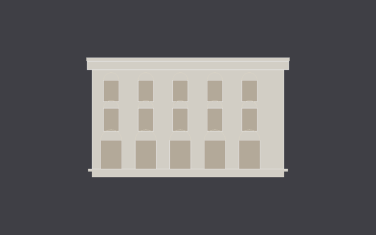

*A front elevation (`front`), the natural way to read a facade. There's no
dedicated arch or tracery generator — the whole thing is honest primitives:
`box` for the plinth, wall, piers and cornice; `arc` + `rotate` for each round
arch head; and `array` to repeat every element across the five bays and stack the
floors. In perspective it's a real 3-D slab with a projecting plinth and cornice:*

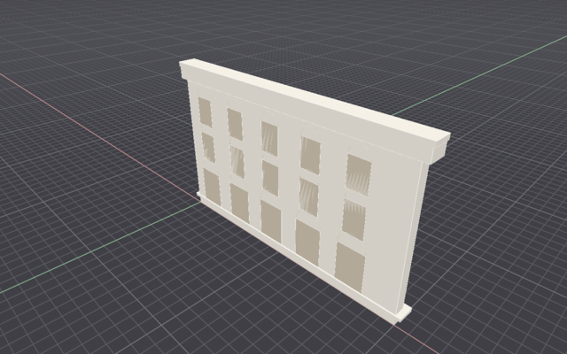

### Drawings → BIM
`fromlayer <layer> wall thick <t>` turns the 2D curves on a layer into typed BIM
walls (exported as `IFCWALL`), extruded from a level base by an explicit height
or a named story · `story` / `level` define building stories by name + base
elevation (with an optional floor-to-floor height `fromlayer` reads), and
`levels` lists them.

### Blocks & external references
`xref attach` links another drawing file in as a reloadable referenced instance
(`xref list` / `reload` / `detach`) · `ncopy` copies one nested object out of a
block/xref instance as an independent object · `xclip` clips a block/xref
instance to a rectangular boundary · `dataextract` (alias `bom`) tabulates block
instances by definition or per-instance, to a table or CSV.

Define a `tree` block from two boxes, `array` a grove of instances, then
`xref attach` an external drawing twice and `xclip` one of the references to a
rectangle (the script exports the referenced `pavilion.dxf` first so it resolves
anywhere):

```
box 0,0,0 6,6,0.3
box 0,0,0.3 6,0.3,3
box 0,5.7,0.3 6,0.3,3
export /tmp/pavilion.dxf
delete all
box 0,0,0 0.4,0.4,3
box -0.6,-0.6,3 1.6,1.6,1.2
block last 2 tree
delete last 2
insert tree 4,4,0
array last 4,3,1 8,7,0
xref attach /tmp/pavilion.dxf at 4,26,0
xref attach /tmp/pavilion.dxf at 20,26,0
xclip last 20,26 24,30
```

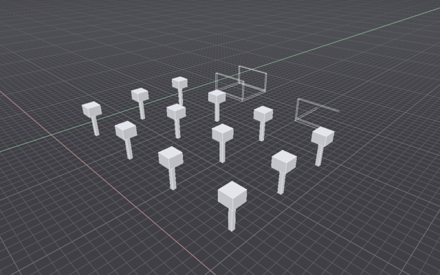

*A 4 × 3 `array` of `tree` block instances in front, and two `xref`-attached
pavilions behind — the right one `xclip`'d to a rectangle so only the geometry
inside the boundary renders. Editing the block definition (or `xref reload`-ing
the source file) updates every instance at once. The rendered scene omits the
`export`/`delete all` setup lines above, which only stage the reference file.*


*`elevation south`: a clean projected facade — the drafting output, straight from the model.*

### Exchange

| Direction | Formats |
|---|---|
| Import | **DWG** (assisted) · DXF · OBJ · STL · glTF/GLB · Collada · **IFC** · **3DM** (Rhino) · GeoJSON · OSM (Overpass export) · LAS / **LAZ** / **E57** point clouds · EPW · STEP† |
| Export | DXF · OBJ · STL · glTF/GLB · **IFC4** (incl. structural analysis model) · **3DM** · **SAF `.xlsx`** (structural handoff) · SVG · CSV · PDF · **JPG** · **`.ai`** (Adobe Illustrator — SVG-content) · STEP† |

IFC is the Revit bridge — both directions, hand-written, zero dependencies, and
includes typed structural members + the `IfcStructuralAnalysisModel` graph. SAF
2.2.0 exports a genuine `.xlsx` workbook for RFEM / SCIA / AxisVM / FEM-Design.
Both carry a **geometry+topology-only, no-analysis-results** disclaimer — the app
never claims to analyse. Native save stays the op-log JSON. †STEP needs the
opt-in `kernel-occt` feature.

**DWG** is an *assisted* bridge: the AutoCAD `.dwg` importer shells out to a
user-installed `dwg2dxf` (LibreDWG, `brew install libredwg`) to convert to DXF,
then imports through the hardened DXF path — LibreDWG is GPLv3 and is **never
linked or bundled**, so the AGPLv3 distribution stays clean. A truncated
conversion is rejected with a clear error, never a silent empty import. Files can
be **dragged and dropped** onto the window to import.

A raster **image underlay** for tracing scans places a PNG flat on the ground
(`underlay`), then repositions dynamically: `underlaymove`, `underlayscale`,
`underlayrotate`, `underlayplace` (set corner + width + rotation in one shot for
calibration), and `underlayopacity`.

<a id="cad-parity-commands"></a>
### CAD-parity commands

A compact reference for the CAD-parity batch. Names and usage match the in-app
registry exactly — type `help <verb>` for the full text, or see
[docs/COMMANDS.txt](docs/COMMANDS.txt).

**Drafting & edit**

| Verb | Usage | What |
|---|---|---|
| `trim` | `trim <target> <cutter> <keep x,y>` | Cut a curve at a cutter, keep the picked piece |
| `powertrim` | `powertrim <target> <pick x,y>` | Trim against *all* curves at once; delete only the picked segment |
| `stretch` | `stretch <sel> <min> <max> <delta>` | Move only vertices inside a box (curves/points; meshes skipped) |
| `flatten` | `flatten <sel>` | Project every vertex to the XY ground (Z=0) |
| `tozero` | `tozero <sel>` | Move bounding-box min to the origin (alias `toorigin`) |
| `align` | `align <sel> <s1> <t1> <s2> <t2> [scale on/off]` | Match two source points to targets (planar, about Z; alias `orient`) |
| `arraycurve` | `arraycurve <sel> <path> <count> [align on/off]` | Distribute copies along a path curve |
| `linetan` | `linetan <from x,y,z> <curve>` | Line from a point tangent to a curve |
| `lineperp` | `lineperp <from x,y,z> <curve>` | Line from a point perpendicular to a curve |
| `circletan` | `circletan <curveA> <curveB> <radius>` | TTR circle (line–line case; alias `circlettr`) |

**Selection**

| Verb | Usage | What |
|---|---|---|
| `selregion` | `selregion <min> <max> [window/crossing]` | Rectangle select (aliases `selwindow`, `selcrossing`) |
| `selsimilar` | `selsimilar <sel> [layer/color/type/weight]` | Select all sharing a property (alias `selsim`) |
| `seldup` | `seldup [<sel>]` | Select geometric duplicates (alias `selduplicate`) |

**Dimensions & annotation**

| Verb | Usage | What |
|---|---|---|
| `dimradius` | `dimradius <sel>` | Radial dimension for a circle/arc (alias `dimrad`) |
| `dimdiameter` | `dimdiameter <sel>` | Diameter dimension (alias `dimdia`) |
| `dimangular` | `dimangular <vertex> <p1> <p2> [radius]` | Angle p1-vertex-p2, labelled in degrees |
| `autodim` | `autodim <sel> [offset <d>]` | Batch-dimension a selection (alias `autodimension`) |
| `field` | `field <pos> <expr> [height]` | Live text: `area`/`length`/`count`/`layer`/`units` |

**Curves & regions**

| Verb | Usage | What |
|---|---|---|
| `boundary` | `boundary <seed x,y,z> [from <sel>]` | Trace a closed boundary polyline around a seed point |
| `curvebool` | `curvebool <union/intersect/difference> <sel>` | Combine closed **planar** curves (aliases `cboolean`, `region`) |
| `polygon` | `polygon <center> <radius> <sides>` | Regular polygon (also an interactive tool) |
| `hatchpat` | `hatchpat <path.pat>` | Import AutoCAD `.pat` hatch patterns (dash cadence approximate) |

**Drawings → BIM**

| Verb | Usage | What |
|---|---|---|
| `fromlayer` | `fromlayer <layer> wall thick <t> [height <h> / level <name>]` | Layer curves → typed BIM walls (export `IFCWALL`) |
| `story` | `story <name> <elevation> [height <h>]` | Define a building story/level (alias `level`) |
| `levels` | `levels` | List defined stories/levels (query) |

**Coordinate systems**

| Verb | Usage | What |
|---|---|---|
| `cplane` | `cplane [world / origin <o> normal <n> / 3point <o> <px> <py> / save <name> / <name>]` | Construction plane / UCS (alias `ucs`). `rect`/`circle`/`box` support translated/upright planes only; `line`/`polyline` any plane |

**Blocks & external references**

| Verb | Usage | What |
|---|---|---|
| `xref` | `xref attach <path> [at] [scale] [rot] / list / reload <name> / detach <name>` | Link a drawing file as a reloadable referenced instance |
| `ncopy` | `ncopy <instance> <index>` | Copy one nested object out of a block/xref instance |
| `xclip` | `xclip <instance> <min> <max>` / `xclip <instance> off` | Clip a block/xref instance to a rectangle |

**Sheets & output**

| Verb | Usage | What |
|---|---|---|
| `sheetset` | `sheetset <new/add/remove/order/list/publish>` | Ordered index over sheets → one multi-page PDF |
| `plotstyle` | `plotstyle <new/set/list/apply/none/delete>` | Named pen table (color + weight + screening), applied at print |
| `dataextract` | `dataextract [by count/instance] [to <path.csv>]` | Tabulate block instances (aliases `dataextraction`, `bom`) |

**Image underlay** — `underlay` places a PNG to trace over; `underlaymove` /
`underlayscale` / `underlayrotate` / `underlayplace` / `underlayopacity` /
`underlayoff` position and calibrate it.

### Automate

```sh
itsjustcad --run script.txt --headless --shot render.png --out model.itsjustcad.json
```

Full headless CLI with exit codes (0 ok / 1 command error / 2 IO) —
scriptable from CI, cron, or another program. `-` reads stdin.

---

## The deck (LLM partner)

The right panel is not a chatbot bolted on — it speaks the command substrate.


*"Draw a podium, then a tower on top" — the deck emits the same commands you'd type, as cards you can inspect, undo, or amend.*

- **Draws** by emitting commands you can inspect (click the command card),
  undo, or amend — and can drive the view, camera, and window layout too
- **Teaches**: ask *"how do I make walls from a centerline?"* — it explains
  `offset → extrude → difference` instead of just doing it
- **Plans**: for multi-stage work it first lays out a numbered plan, then
  executes it step by step, retrying failed steps and verifying at the end
- **Asks before guessing**: on an ambiguous request it asks one clarifying
  question instead of inventing dimensions
- **Critiques with numbers**: run an analysis or `codecheck`, then it reads the
  structured `report` and grounds its critique in sampled values and rule ids
- **Sees**: press **critique** — it screenshots your viewport and reviews the
  massing like a design critic
- **Talks terse**: a token-frugal reply style (default on for local models,
  toggleable) and rich **markdown tables** rendered as real grids in the chat
- **Knows your selection**: select something, say "make this taller"
- **Builds tools**: authors persistent plugins on request
- Failed commands feed back automatically for self-correction; conversations
  survive restarts (optionally **encrypted at rest**, opt-in via
  `chatencryption on`); **local-only** toggle keeps everything on your machine

Configure cassettes in `~/.config/itsjustcad/decks.json`:

```json
{
  "decks": [
    { "name": "claude-code", "kind": "claude_code", "model": "sonnet" },
    { "name": "ollama",  "kind": "openai_compat",
      "base_url": "http://localhost:11434/v1", "model": "qwen3" },
    { "name": "claude",  "kind": "anthropic",
      "base_url": "https://api.anthropic.com",
      "model": "claude-sonnet-4-6", "api_key": "env:ANTHROPIC_API_KEY" }
  ],
  "active": 0
}
```

`api_key` is a literal or `env:VAR`. The model receives the command registry
and a scene digest; it never touches raw geometry.

---

## Keyboard & mouse

| | |
|---|---|
| RMB drag / Shift+RMB / scroll | orbit / pan / zoom |
| `l` `r` `c` `p` | line / rect / circle / polyline tools |
| Delete · Cmd+Z / Cmd+Shift+Z · Cmd+A · Cmd+C/V · Cmd+S | the usual |
| Tab | accept autosuggest |
| Cmd+\ | collapse the deck pane |
| Esc | cancel tool / deselect |
| Drag L→R / R→L | window / crossing select |

---

## Architecture

```
crates/
  kernel-mesh/    f64 face-vertex meshes, primitives, extrusion, BSP CSG,
                  surfacing (revolve/loft/sweep/sweep2), sections, BVH, Delaunay
  kernel-curve/   line/polyline/arc/ellipse/NURBS (own de Boor), tessellation,
                  offset, intersections, fillet
  kernel-brep/    stub — exact BREP planned
  solar/          NOAA SPA solar position, shadow projection, EPW parsing
  doc/            scene state (layers, sheets, blocks, units, sun); knows
                  nothing about how it is mutated
  commands/       THE substrate: Command enum, parser, registry, Session
                  (op-log + inverse-op undo + amend + options + replay),
                  file io, plugins, exporters/importers (dxf/pdf/svg/csv/
                  mesh/ifc/las/geojson/osm)
  deck/           LlmDeck trait, Claude-CLI + OpenAI-compat + Anthropic
                  adapters, streaming ```draft extractor, prompt builder
  render/         wgpu pipelines in egui paint callbacks, display modes,
                  per-viewport cameras, headless renderer
  app/            shell: viewport(s), command line + autosuggest, deck pane,
                  panels, osnap, gumball, keymap, presets, journal
```

## Building & testing

```sh
cargo build --release        # single ~10 MB binary
cargo test --workspace       # 630+ tests
cargo clippy --workspace
scripts/bundle-macos.sh      # unsigned .app bundle

# headless render, no window needed
cargo run -p itsjustcad-render --example headless -- out.png scene.itsjustcad.json

# scripted GUI run: commands + screenshot (used by CI and agents)
ITSJUSTCAD_RUN="rect 0,0,0 6 4;extrude last 3" \
ITSJUSTCAD_SHOT=/tmp/shot.png cargo run -p itsjustcad

# golden-image regression tests
cargo test --workspace -- --ignored golden
```

Minimal dependencies by policy: the CSG engine, DXF/PDF/SVG/glTF/IFC
readers-writers, solar math, Delaunay, and BVH are written in-repo. That
policy — not just Rust — is why the binary is ~10 MB.

## Documentation

New here? Start with the **[tutorials](docs/tutorials/)** — four guided,
step-by-step walkthroughs a working architect can follow top to bottom:

| # | Tutorial | You end with |
|---|---|---|
| 1 | [Getting started](docs/tutorials/01-getting-started.md) | Your first massing — orbited, saved, printed to a PDF sheet |
| 2 | [Site planning with intemfit](docs/tutorials/02-site-planning.md) | A subdivided site with buildings and a yield report |
| 3 | [Environmental analysis](docs/tutorials/03-environmental-analysis.md) | A sun-hours study read in numbers and critiqued by the deck |
| 4 | [Working with the deck](docs/tutorials/04-deck.md) | The LLM drawing and analysing in the same commands you type |
| 5 | [Render with the ray tracer](docs/tutorials/05-raytrace.md) | A photoreal PBR render of your real model — sun shadows and GI, in-app |
| 6 | [Edit a parametric structure](docs/tutorials/06-parametric.md) | A live-editable dome tuned from the Parameters tab, then frozen |

There's also a self-contained **[landing page](docs/index.html)** (open it in a
browser) and **[ready-to-open example documents](examples/)** — a massing, a
courtyard sheet, and a full intemfit site.

| Reference | What |
|---|---|
| [docs/getting-started.md](docs/getting-started.md) | Install, first model, the command language at a glance |
| [docs/command-reference.md](docs/command-reference.md) · [docs/COMMANDS.txt](docs/COMMANDS.txt) | Every command with its exact usage |
| [docs/deck.md](docs/deck.md) | The LLM partner — cassettes, terse mode, plugins, encryption |
| [docs/interop.md](docs/interop.md) | DXF · IFC · 3DM · SAF · point-cloud exchange |
| [docs/file-format.md](docs/file-format.md) · [FORMAT.md](FORMAT.md) | The op-log file format + stability promise |
| [docs/plugins.md](docs/plugins.md) | Runtime-authored command macros |
| [CONTRIBUTING.md](CONTRIBUTING.md) | Tests-required, one-substrate rule, minimal deps |
| [docs/ui-legacy-research.md](docs/ui-legacy-research.md) | The AutoCAD/Rhino/Revit conventions the skins implement |

## License

Copyright © 2026 Hector Tarrido-Picart.

**The desktop app is free and open source under AGPL-3.0-or-later** (see
[`LICENSE`](LICENSE) and [`NOTICE`](NOTICE)) — use it, fork it, build on it. The
AGPL's copyleft means any modified or network-served version must also be open.

**Commercial and mobile licensing** (a paid iOS / iPadOS / tablet edition) are
offered separately by the author under proprietary terms — the AGPL covers the
open desktop build only. Contributions are welcome under a CLA (see
[`CONTRIBUTING.md`](CONTRIBUTING.md)).

The file format and command language are documented and stable — build on them.
