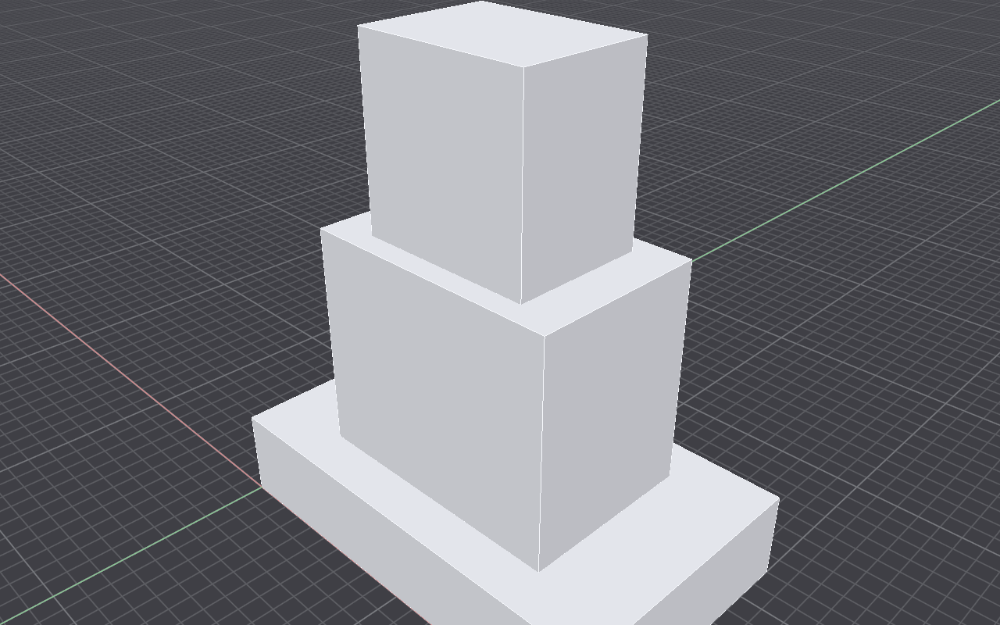

# mydrafter

FOSS Rust CAD for architects — Rhino-style command line, 3D viewport, and an
LLM drafting companion **inside** the app, not bolted on as an external plugin.

AGPLv3. Pure Rust (egui + wgpu + glam). Cross-platform (Linux / macOS / Windows).



## The one-command substrate

The central bet: **one command substrate**. The human command line and the LLM
deck emit the same `Command` enum. The document *is* the ordered op-log of
those commands — undo, the file format, and replay all derive from it
automatically. Every session doubles as a training transcript.

```
human types "extrude last 3"
      │
LLM emits   {"cmd":"extrude","profile":{"sel":"last","n":1},"height":3.0}
      │
      ▼
   parse → Command::Extrude { … }
      ↓
   apply  (fills id, writes it back)
      ↓
   op-log (the saved file)
```

## Status

MVP: geometry on screen, two ways — command line and LLM.

- Perspective viewport: infinite grid, Z-up orbit camera, click-select, `ze`
  zoom extents
- Command language: `box`, `extrude`, `revolve`, `loft`, `sweep`, `line`,
  `polyline`, `rect`, `circle`, `arc`, `ellipse`, `polygon`, `curve` (NURBS),
  `union`, `difference`, `intersect`, `section`, `plan`, `dim`, `text`,
  `hatch`, `move`, `copy`, `array`, `polar_array`, `rotate`, `scale`,
  `mirror`, `split`, `trim`, `extend`, `join`, `fillet`, `offset`, `delete`,
  `name`, `group`, `layer`, `units`, `sheet`, `print`, `export`, `undo`,
  `redo`, and more
- LLM deck: describe what to draw; commands stream out and execute live;
  failed commands are fed back automatically
- Save / load: op-log JSON (`save scene.mydrafter.json`, `open …`, Cmd+S/O)

## Build

Requires Rust stable (see `rust-toolchain.toml`).

```sh
git clone https://github.com/htarrido/mydrafter
cd mydrafter
cargo run -p mydrafter
```

Try in the command line (bottom bar):

```
rect 0,0,0 6 4
extrude last 3
circle 12,2 2.5
extrude last 8
ze
```

Or tell the deck (right pane): *"make three 4×4×3 towers in a row, 6 m apart"*.

Run tests:

```sh
cargo test --workspace
cargo clippy --workspace -- -D warnings
```

## LLM decks ("cassette player")

Any OpenAI-compatible endpoint or Anthropic. Configure
`~/.config/mydrafter/decks.json`:

```json
{
  "decks": [
    { "name": "ollama",  "kind": "openai_compat",
      "base_url": "http://localhost:11434/v1", "model": "gpt-oss:20b" },
    { "name": "claude",  "kind": "anthropic",
      "base_url": "https://api.anthropic.com",
      "model": "claude-sonnet-4-5", "api_key": "env:ANTHROPIC_API_KEY" },
    { "name": "kimi",    "kind": "openai_compat",
      "base_url": "https://api.moonshot.ai/v1",
      "model": "kimi-k2-0905-preview", "api_key": "env:MOONSHOT_API_KEY" }
  ],
  "active": 0
}
```

`api_key` is a literal or `env:VAR`. Swap decks with the combo box in the deck
pane. The model receives the command registry and a scene digest; it never
touches raw geometry.

## Architecture

```
crates/
  kernel-mesh/    f64 face-vertex meshes, primitives, extrusion, BSP CSG
  kernel-curve/   line/polyline/arc/ellipse/NURBS (own de Boor), tessellation
  kernel-brep/    stub — truck-based BREP planned
  doc/            scene state; knows nothing about how it is mutated
  commands/       THE substrate: Command enum, parser, registry, Session
                  (op-log + inverse-op undo + replay), file io
  deck/           LlmDeck trait, OpenAI-compat + Anthropic SSE adapters,
                  streaming ```draft extractor, system prompt builder
  render/         wgpu pipelines in egui paint callbacks, grid shader,
                  orbit camera, headless renderer
  app/            shell: viewport, command line, deck pane
```

File format: see [`FORMAT.md`](FORMAT.md).
Contributing: see [`CONTRIBUTING.md`](CONTRIBUTING.md).

## Dev hooks (CI / agents)

```sh
# render a scene headlessly (no window needed)
cargo run -p mydrafter-render --example headless -- out.png scene.mydrafter.json

# scripted app run: commands + screenshot
MYDRAFTER_RUN="rect 0,0,0 6 4;extrude last 3" \
MYDRAFTER_SHOT=/tmp/shot.png cargo run -p mydrafter

# golden-image regression test (requires blessed PNGs in tests/golden/)
cargo test --workspace -- --ignored golden
```

## License

AGPL-3.0-or-later. See [`LICENSE`](LICENSE).

Dependency licenses enforced with `cargo deny check licenses`.
